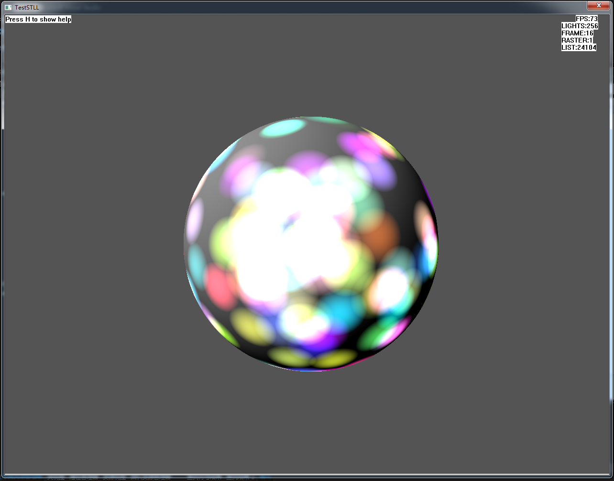
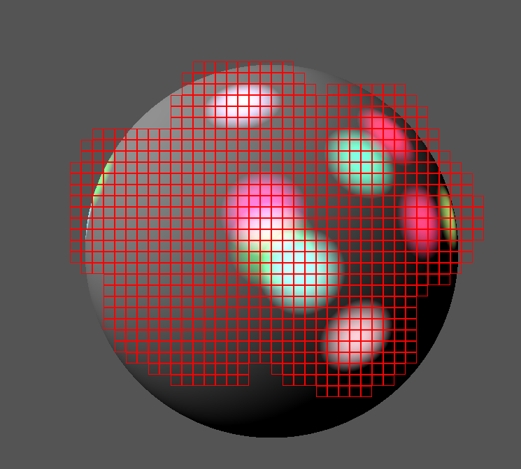

#Software Tiled Lighting List Demo

##Features

1. Pre-computed software RayTrace G-Buffer
2. Software Defered Tiled per-pixel Lighting
3. Software rasterizing point light to tile list

##License

Copyright (C) pech dai (<daipech@163.com>).

oz01 was the author of EasyMath Library.

##Screen Captures

256 point lights:

64 point lights with tiles area gizmos
